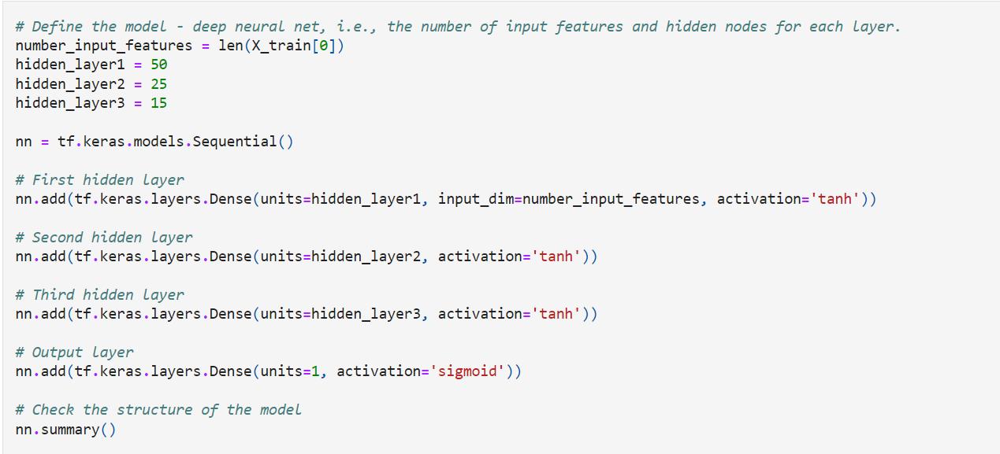
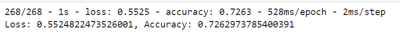

# Neural_Network_Charity_Analysis

## Purpose

Create a binary classifier that is capable of predicting whether applicants will be successful if funded by Alphabet Soup.
Preprocessing data for a neural network model. Compile, train, and evaluate the model. Optimize the model.

## Results

### Data Preprocessing
 - The target variable was the "IS_SUCCESSFUL" column of the data
 - The features for the model was the rest of the data excluding the dropped columns "EIN" and "NAME"
 - "EIN" and "NAME" were neither targets nor features and were dropped from the dataset
 
 
### Compiling, Training, and Evaluating the Model
 - For my neural network model I chose: 3 layers, with 50, 25, and 15 neurons, using a tanh activation function.
 - I chose these specifications because extra layers allow for more levels of optimization
 - I chose 50, 25, 15 to slowly filter the data
 - I chose tanh as the activation function to potentially create a bigger learning step
 
 - I was not able to achieve the target model performance of 75%
 
 - To try and increase model performance, I dropped columns "STATUS" and "SPECIAL_CONSIDERATIONS" 
   because a vast majority of the data was one of two options in both columns
 
 - I added more neurons and hidden layers, I changed the activation function of the hidden layers as well
 
 ## Summary
 
 
 
 The deep learning model was able to identify if an applicant would be successful with 72.6% accuracy.
 
 I believe a RandomForestClassifier would be able to predict success with greater accuracy than a deep_learning model.
 A RandomForestClassifier would be better for the small amount of data that is given and would prevent overfitting.
 
